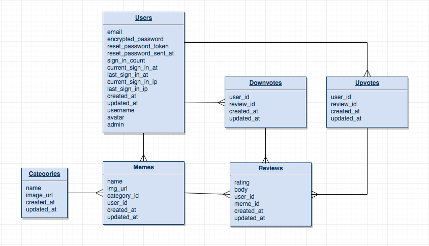

# GoodMemes
[ ](https://app.codeship.com/projects/196494)


## Description
A rails app that allows users to post hot new memes from around the web. Users can view memes a collection of memes based off the base image. Users can add reivews on individual memes using the HotSpringScale(tm). In addition you can Up Vote and Down Vote specific reviews.
[Click Here To View Heroku Application](https://good-memes.herokuapp.com/)

## ER Diagram

## Challenges Faced
* Incorporating Devise for user authentication and an admin interface
* Utilizing the Rails back-end as an API for use with Fetch calls
* Incorporating React components within Rails View Templates
* Implementing CarrierWave to allow users to upload avatars

## Setting Up Locally

1. First clone down the repo, bundle, load the schema, and run the seed file.
  ```
  $ git clone https://github.com/jonsavagek36/good-memes.git
  
  $ bundle
  
  $ npm install
  
  $ rake db:setup
  ```
2. Start the Rails server.
  ```
  $ rails server
  ```
3. Start the Node server.
  ```
  $ npm start
  ```
4. Visit [your application](http://localhost:3000).
